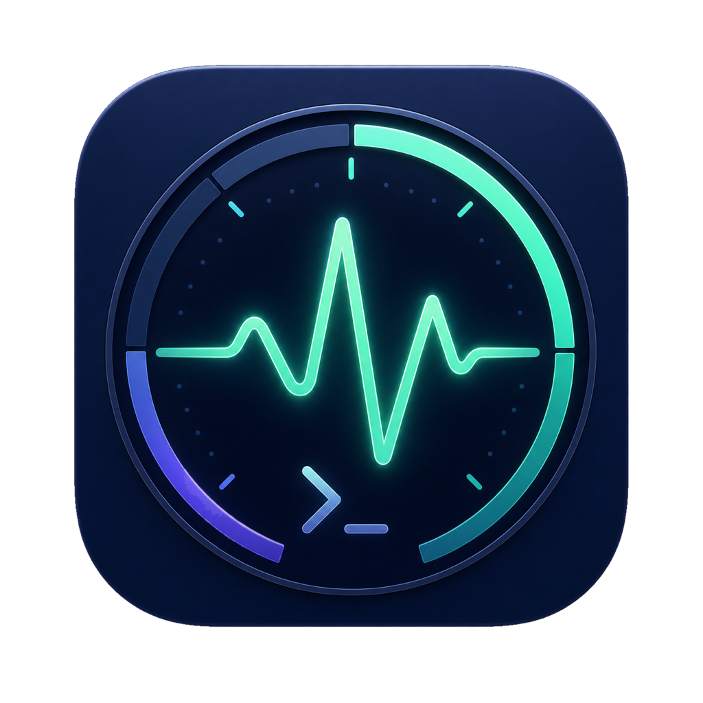

# Codex Pulse

<p align="center">
  
</p>

Codex Pulse is a native macOS floating usage monitor for Codex. It reads real-time rate limits and token usage for the currently signed-in account through Codex's local app-server protocol. It does not read or store account credentials.

## Download

Download `CodexPulse-macOS.zip` from [GitHub Releases](https://github.com/zhaotianjing/codex-pulse/releases/latest), unzip it, and open `Codex Pulse.app`.

Each release also includes `SHA256SUMS` and `CodexPulse-build-info.txt`. The build information records the source commit, app version, executable architecture, and signing status without including the builder's username or local path.

## Requirements

- macOS 14 or later
- An Apple Silicon Mac (the current prebuilt release is arm64)
- ChatGPT or Codex installed, with Codex signed in through a ChatGPT account

No OpenAI API key is required. Accounts signed in with an API key may not provide ChatGPT plan rate-limit data.

## Features

- Always-on-top floating window that can appear across desktops
- Primary Codex rate limit and reset countdown
- Other independent account-level limit pools, clearly marked as separate from the active model
- Lifetime and peak daily token usage
- Automatic refresh every 5 minutes, plus manual refresh
- Verification of the official OpenAI code signature before Codex is launched
- Bounded process output and sanitized on-screen errors
- A minimize button that collapses the window into a visible compact bar
- Menu bar controls to show, hide, refresh, or quit
- Reopening the app automatically brings the window back
- No Dock icon, with automatic window-position persistence

## Run the App

1. Make sure Codex or the ChatGPT desktop app is installed and signed in.
2. Move `Codex Pulse.app` to the Applications folder and open it.

### First Launch: Open Anyway

The current release uses local ad-hoc code signing with Hardened Runtime enabled, but it is not signed with an Apple Developer ID or notarized by Apple. Hardened Runtime adds process protections, while an ad-hoc signature does not authenticate the publisher. On first launch, macOS may display a **“Codex Pulse” Not Opened** warning because Apple cannot verify the developer.

Only override this warning when the app was downloaded from this repository's official [GitHub Releases](https://github.com/zhaotianjing/codex-pulse/releases/latest) page.

1. In the warning dialog, click **Done**. Do not click **Move to Trash**.
2. Open **System Settings** and select **Privacy & Security**.
3. Scroll down to the **Security** section.
4. Find the message that says **“Codex Pulse” was blocked to protect your Mac**.
5. Click **Open Anyway**.
6. Authenticate with Touch ID or your Mac password, then confirm **Open**.

This approval is normally required only once. If **Open Anyway** does not appear, try opening `Codex Pulse.app` again and immediately return to **System Settings → Privacy & Security**. See [Apple's official instructions](https://support.apple.com/102445) for additional details.

### Verify the Download

Download `CodexPulse-macOS.zip` and `SHA256SUMS` from the same release into the same folder. In Terminal, change to that folder and run:

```bash
grep ' CodexPulse-macOS.zip$' SHA256SUMS | shasum -a 256 --check
```

The expected result is `CodexPulse-macOS.zip: OK`. This confirms that the archive matches the checksum attached to that release. Because the checksum and archive are hosted together and the app is not Developer ID signed, this detects accidental corruption or a mismatched download but does not independently prove the publisher's identity.

### Start Automatically After Login (Optional)

To launch Codex Pulse automatically whenever you sign in to your Mac:

1. Make sure `Codex Pulse.app` is in the Applications folder.
2. Open **System Settings → General → Login Items & Extensions**.
3. Under **Open at Login**, click the **Add (+)** button.
4. Select `Codex Pulse.app` from the Applications folder.
5. Click **Open**.

Keep the app in the Applications folder after adding it. To disable automatic launch later, return to **Open at Login**, select **Codex Pulse**, and click the **Remove (−)** button.

When upgrading from version 1.0.2 or earlier, macOS may treat version 1.1.0 as a new app because it now uses a unique bundle identifier. The saved window position may reset. If automatic launch stops working, remove the old Login Item and add the new app again.

## Build from Source

Building requires macOS 14 or later and Swift 5.9 or later:

```bash
chmod +x build-app.sh
./build-app.sh
```

Build artifacts are written to `outputs/`. The build script enables Hardened Runtime, verifies the resulting ad-hoc signature, creates a source archive with stable file ordering and timestamps, writes provenance to `CodexPulse-build-info.txt`, and generates `SHA256SUMS` for the release files.

If an official OpenAI-signed Codex executable is not in a standard installation path, quit Codex Pulse, then set its absolute location before launching:

```bash
export CODEX_USAGE_CODEX_BIN=/path/to/codex
open "outputs/Codex Pulse.app"
```

The override does not bypass security checks. Codex Pulse rejects the file unless its Developer ID signature, OpenAI Team ID, and executable identifier are valid.

## Privacy

Codex Pulse does not parse `~/.codex/auth.json`, request account profile data, or store API keys, access tokens, email addresses, or usage history. Each refresh starts Codex's local app-server and requests only `account/rateLimits/read` and `account/usage/read`. See [PRIVACY.md](PRIVACY.md) for details.

## License

[MIT](LICENSE)
